# Membership Website

Premium content is only available to paid subscribers. Welcome to membership website development.

## Payment Processor

We use Stripe as the payment processor in our membership website.

## Designer

We use Figma as the design platform.

# Design Primitives and Components

Design/Edit your primitives and components in Figma.

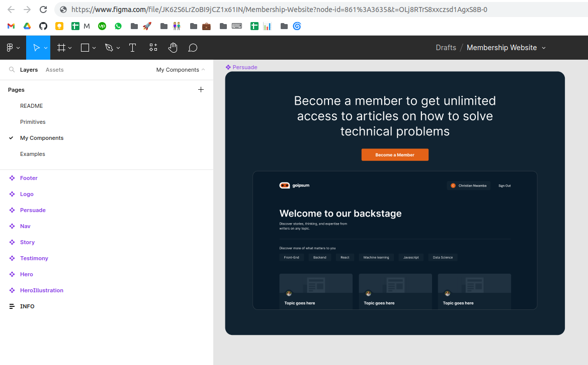

# Deploy Data Models

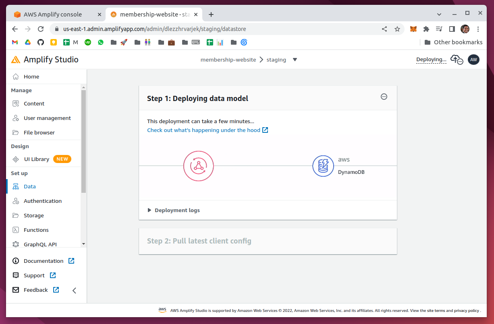

# Fetch Figma

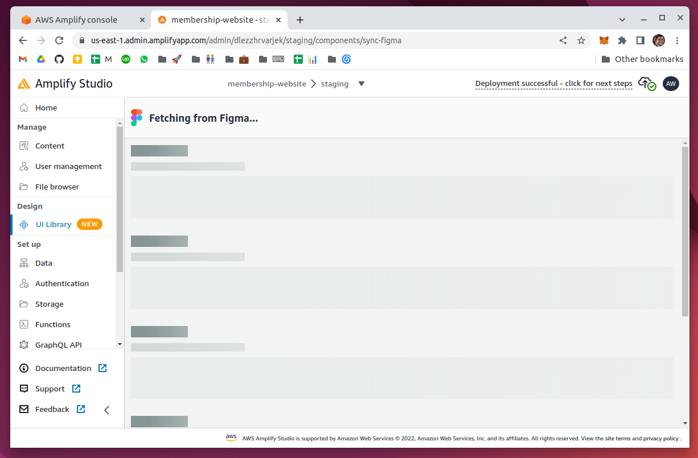

# Backstage Ready

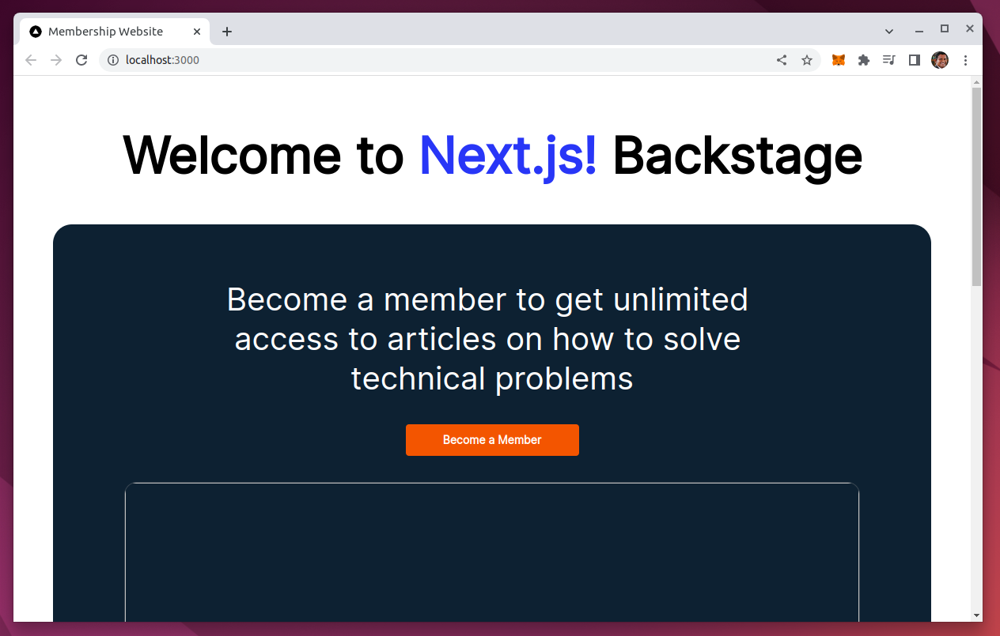

# Testimonial Collection

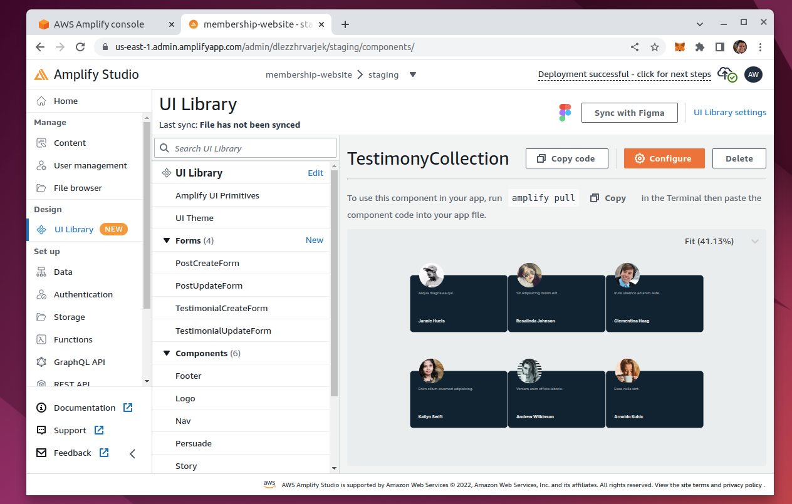

# Stripe Membership Product

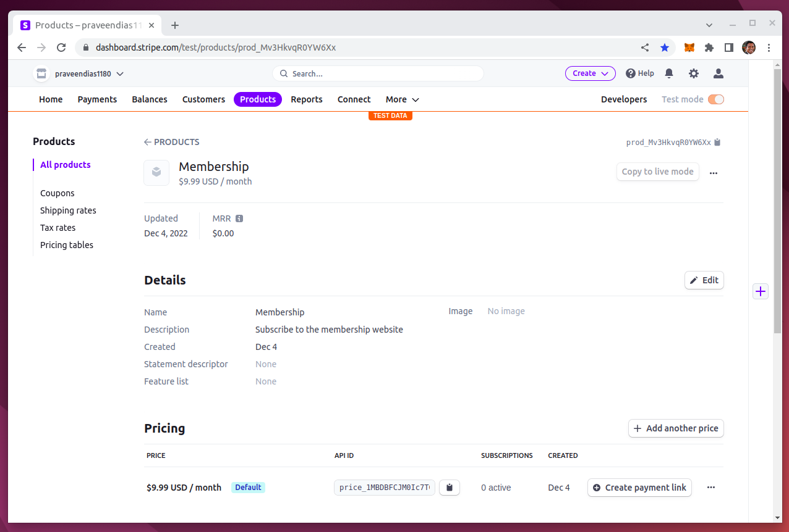

# Stripe Checkout

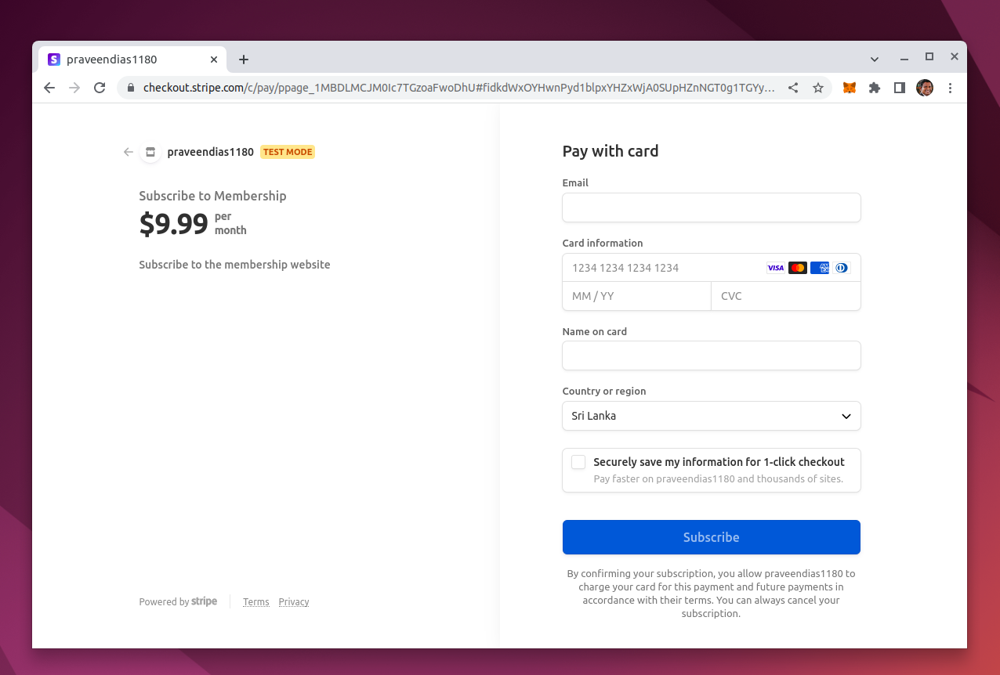

# Stripe Webhook Succeeded

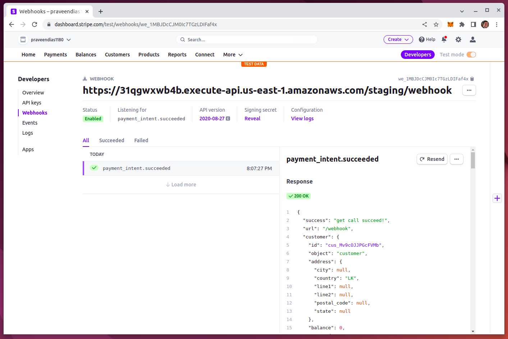

# CloudWatch Logs

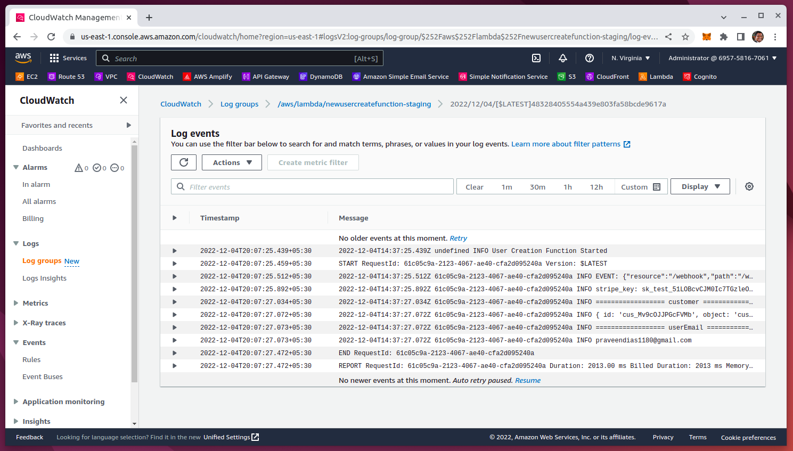

# Amazon API Gateway

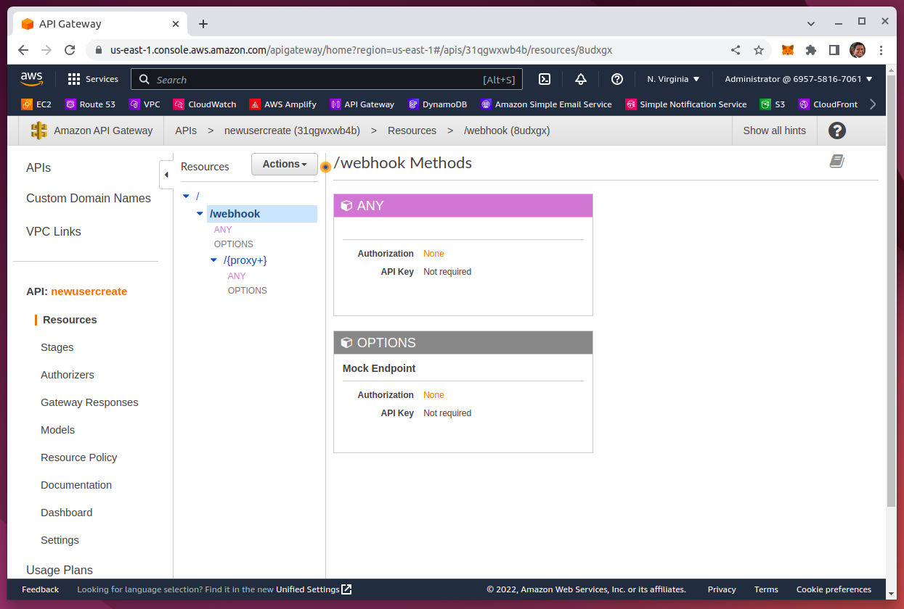

# Email Verification

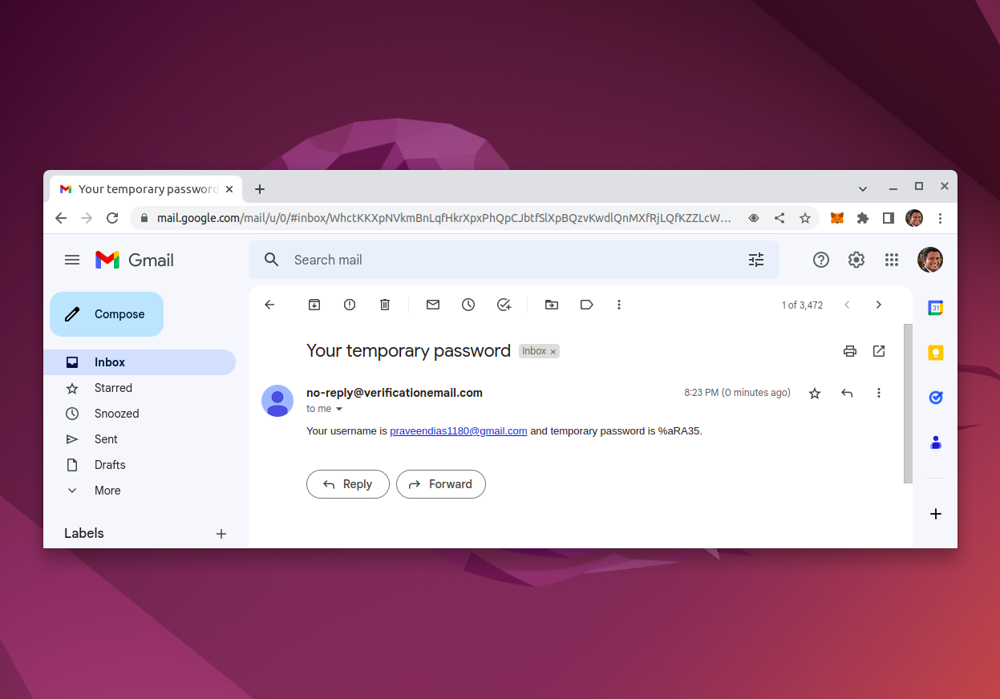

# Amazon Cognito User Pool

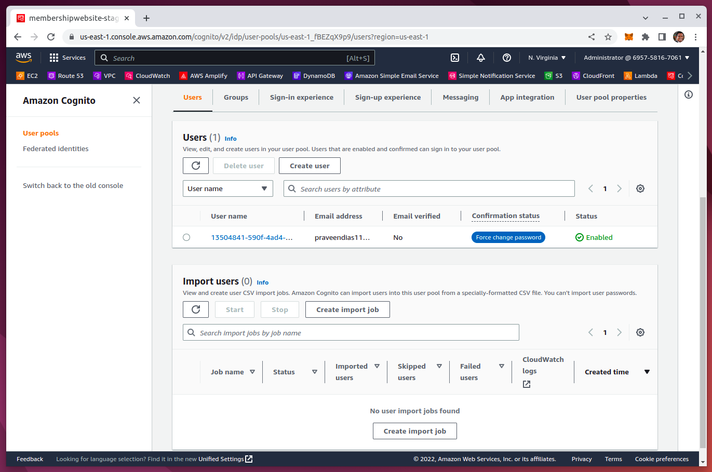

# Delete Resources

Delete All AWS Resources - Lambda | API Gateway | Cognito | CloudWatch Log | DynamoDB | S3 | etc.

Change/Roll the Stripe API keys. Delete webhooks.

# Demo

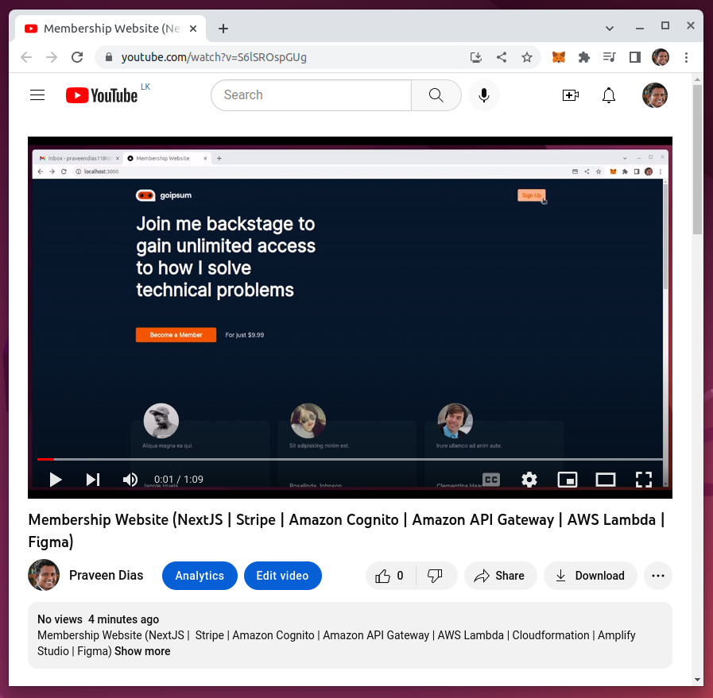

https://www.youtube.com/watch?v=S6lSROspGUg